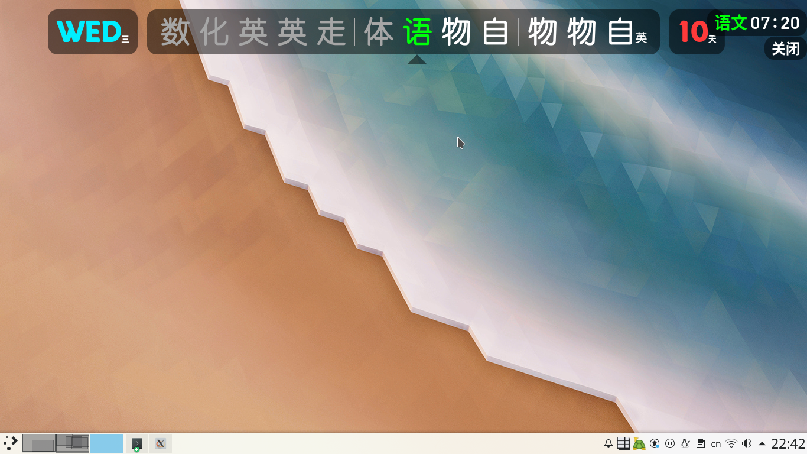
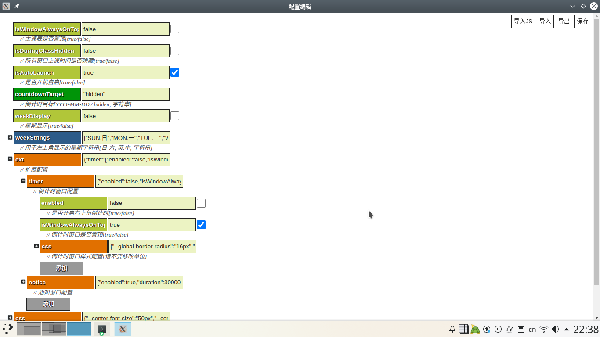

# 电子课程表

## 软件介绍

- 功能列表:
  - 显示当天课表
  - 课表, 日程表自动轮换
  - 显示当前星期
  - 显示天数倒计时
  - 显示上课/下课倒计时(支持单独置顶, 具有关闭按钮)
  - 窗口置顶+点击穿透
  - 显示作业等通知内容
  - 图形化配置界面(通知, 配置, 课表)
- 使用Html + CSS + JavaScript三件套制作，使用Node.js+Electron完善系统级功能并打包。
- 软件由一位高三牲制作，含有大量屎山代码，望大家海涵。
- 在电子白板在学校普及的今天，欢迎大家下载体验与分享，但也请不要用于商业用途。
- 喜欢本项目的话，点击右上角的Star或发视频宣传一波支持一下作者吧😘
- [【点我加群】电子课程表QQ交流二群: 914887202](https://qm.qq.com/cgi-bin/qm/qr?k=SL4_VQ9Zmpch-64RbYhkKbTZ5cNjIZ-N&jump_from=webapi&authKey=kxhiNZcQZwoSC/85e3dPxUsL+kpaLIBmxbrcfRLjSJeH35o0D0a/tHBVYI1as5p1)
- [【点我加群】电子课程表TG交流群](https://t.me/ECSchedule)
## 食用说明
以下为在Windows系统下的使用方法，其他操作系统请各位大佬自行拉取仓库打包

- 右侧Releases中下载Latest版本解压，`classSchedule.exe` 为程序主文件
- 打开 `课表编辑` 配置课表和时间表，图形化界面。
- 设置菜单可以通过点击系统托盘打开。
- 菜单中 `配置编辑` `isDuringClassHidden` 选项可控制所有组件在上课时间是否显示
- 菜单中 `配置编辑` `isWindowAlwaysOnTop` 选项可控制主课表是否置顶

或者..尝试终极解决方案：邮箱联系 `enderwolf006@gmail.com` ，如果我有空我可以为你的安装提供帮助，当然你也可以来和我交流问题😊

## 从旧版本迁移

- 打开 `配置编辑` `导入JS` 选择旧的 `scheduleConfig.js` 然后保存
- 打开 `课表编辑` `导入JS` 选择旧的 `scheduleConfig.js` 然后保存

## 详细说明

### 配置界面

通过菜单中 `配置编辑` 打开。

在进行修改过后，请 `保存`。

配置项左侧加号可继续展开，右侧如有复选框可勾选。

右上角菜单栏支持导入导出配置。

所有已有配置均有中文注释。

### 通知界面

通过菜单中 `通知编辑` 进行修改。

在进行修改过后，请 `保存`。

支持计时，固定，自动更新。

左侧 `添加` 添加新通知，可点击已有通知进行编辑。

右方为输入框，即通知内容，可选择是否固定及计时终止时间。

右下方 `添加` 表示添加自动更新，添加后上一个结束后会自动用下方配置创建新通知，支持多个。

### 课表配置

通过菜单中 `课表编辑` 打开。

在进行修改过后，请 `保存`。

#### 数据绑定

这里用于设定基础配置，如 `计时偏移`。

可创建 `临时绑定` 为某天临时指定时间表和课表。

可修改 `数据绑定` 为每个星期指定时间表和课表，支持条件判断。

#### 检查

用于检查课表配置是否存在问题或可能出现的问题。

#### 状态定义

用于创建条件判断所使用的 `变量`。

同 `通知编辑` 相似，左侧创建右侧修改。

- 手动：手动修改变量值。
- 日期自动：基于日期自动修改变量值。
- JS表达式：基于JS表达式对变量求值。

#### 课程

用于定义在课表中使用的 `课程简称` 和 `课程全称`。

在简称中支持使用 `大字体@角表` 来表示课程变体（如语文自习）。

#### 课表

用于创建和修改 `课表`。

同 `通知编辑` 相似，左侧创建右侧修改。

支持条件判断。

需要注意的是，课表从第0节开始。

#### 时间表

用于创建和修改 `时间表`。

同 `通知编辑` 相似，左侧创建右侧修改。

每个条目表示从当前时刻开始至下一时刻的内容。

课程同课表 `第n节` 一致，支持乱序，跳过和重复。

## 修改说明
- **注意：** 阅读以下内容需要一定的编程知识储备。如果您想修改软件源码自行打包（Windows），请阅读此部分内容。若您仅想使用本软件，请跳过此部分内容。
- **声明：** 强烈不推荐直接在打包后的软件中修改源码，这将导致更新新版本与提交 PR 等操作无法顺利进行。
1. 安装 Node.js v20 或以上版本。
2. 安装 Visual Studio v2019 或以上版本。
3. 安装 Python v3.8 或以上版本。
4. 使用 Git 克隆本仓库代码：在终端中执行 `git clone https://github.com/EnderWolf006/ElectronClassSchedule.git`。
5. 在本项目根目录中打开终端并执行 `pip install setuptools`。
6. 在本项目根目录中打开终端并执行 `npm install`。
7. 若需兼容 Windows7/8 系统，需额外执行 `npm install electron@22.3.27`。
8. 在本项目根目录中打开终端并执行 `node_modules/.bin/electron-rebuild`。
9. 在本项目根目录中打开终端并执行 `npm run build`。

- 执行上述环境及命令后，将在根目录生成一个 `out` 文件夹，其中包含您本地打包好的软件文件。
- 然后您可以修改软件代码，使用 `npm start` 调试，使用 `npm run build` 打包。
- 如果您认为您修改开发的软件内容可能对其他人有相似需求，您可以通过 Git 向主分支 `main` 提交 PR（Pull Request）。通过合并后，您的代码将并入主分支，为更多的人提供便利。

## 开源协议

本软件遵循 `GPLv3` 开源协议，以下为该协议内容解读摘要:

* 可自由复制 你可以将软件复制到你的电脑，你客户的电脑，或者任何地方。复制份数没有任何限制
* 可自由分发 在你的网站提供下载，拷贝到U盘送人，或者将源代码打印出来从窗户扔出去（环保起见，请别这样做）。
* 可以用来盈利 你可以在分发软件的时候收费，但你必须在收费前向你的客户提供该软件的 GNU GPL 许可协议，以便让他们知道，他们可以从别的渠道免费得到这份软件，以及你收费的理由。
* 可自由修改 如果你想添加或删除某个功能，没问题，如果你想在别的项目中使用部分代码，也没问题，唯一的要求是，使用了这段代码的项目也必须使用 GPL 协议。
* 如果有人和接收者签了合同性质的东西，并提供责任承诺，则授权人和作者不受此责任连带。
